# Báo cáo Lab Day 1 — Vũ Quốc Huy — 2A202602929

## 1. Thiết lập

- Môi trường: Google Colab, Tesla T4, PyTorch 2.11.0+cu130.
- Dữ liệu: Forest CoverType; 464.809 mẫu train và 116.203 mẫu eval theo `split_metadata.csv`. Từ train, tách validation phân tầng 20% bằng seed 42: 371.847 mẫu train và 92.962 mẫu validation.
- Mô hình M-base: 54→256→128→7, 47.879 tham số. Baseline dùng cross-entropy, SGD momentum 0,9, lr 0,3, batch 512, 20 epoch, He initialization và dropout 0.
- Accuracy validation khi luôn đoán lớp đa số: 0,4876.
- Các chủ đề đã thử: loss, optimizer, hyper-parameter, dropout, gradient clipping, mixed precision và initialization.

## 2. Kiểm tra ban đầu và độ nhiễu

| Kiểm tra | Kết quả |
|---|---|
| Số tham số / shape logits | 47.879 / (B, 7) |
| Loss bước 0 với He (so với ln 7 = 1,9459) | 2,2691 |
| Quá khớp 20 mẫu: loss cuối | 0,001013 sau 20 bước; accuracy 100% |
| Mọi tham số có gradient khác 0 | Có |
| Baseline, số seed đã chạy | 3: `base-s1`, `base-s2`, `base-s3` |
| Baseline: val accuracy (TB ± σ) | 0,9118 ± 0,0027 |
| Baseline: val macro-F1 (TB ± σ) | 0,8607 ± 0,0030 |

Ngưỡng nhiễu tham chiếu là 2σ = 0,00595 trên validation macro-F1. Mỗi biến thể ngoài baseline chạy một seed, nên chênh lệch gần ngưỡng này cần được xem thận trọng.

## 3. Kết quả theo chủ đề

### 3.1 Hàm mất mát — CE và MSE

Dự đoán trước thí nghiệm `loss-mse`: MSE trên logits sẽ học chậm hơn cross-entropy. Sau 20 epoch, MSE đạt val macro-F1 0,7726, thấp hơn baseline trung bình 0,0881, lớn hơn nhiều so với ngưỡng nhiễu 0,00595. MSE có gradient và thang giá trị loss khác cross-entropy, vì vậy so sánh dựa trên macro-F1, không dựa trực tiếp trên loss.

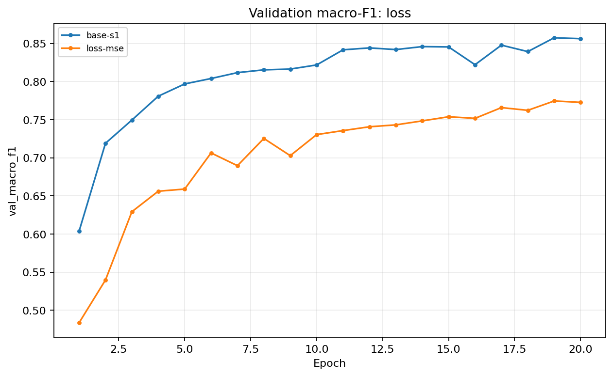

### 3.2 Bộ tối ưu hoá

Ba learning rate được sàng lọc trong 5 epoch trên cùng split và seed. Learning rate có macro-F1 validation cao nhất trong từng nhóm được dùng cho lần chạy 20 epoch.

| Bộ tối ưu hoá | LR chọn | Macro-F1 sau sàng lọc 5 epoch | Macro-F1 sau chạy đủ |
|---|---:|---:|---:|
| SGD (`opt-sgd-bestlr`) | 0,3 | 0,6814 | 0,8163 |
| SGD momentum (`base-s1` đến `base-s3`) | 0,3 | 0,7968 | 0,8607 ± 0,0030 |
| Adam (`opt-adam-bestlr`) | 0,003 | 0,8111 | 0,8677 |
| AdamW (`opt-adamw-bestlr`) | 0,003 | 0,8111 | 0,8677 |

Adam và AdamW cho kết quả trùng nhau vì cấu hình so sánh đặt weight decay bằng 0. Adam cao hơn baseline trung bình 0,0070, nhỉnh hơn 2σ validation 0,00595; đây là bằng chứng vừa phải vì Adam chỉ chạy một seed. SGD thuần thấp hơn baseline.

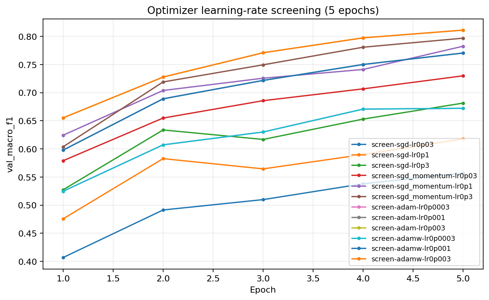
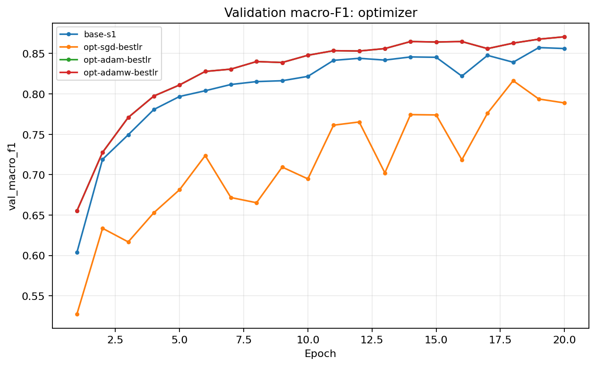

### 3.3 Hyper-parameter

Batch 1024 (`hparam-batch-1024`) đạt macro-F1 0,8482, thấp hơn baseline trung bình 0,0125. Thời gian mỗi epoch giảm từ khoảng 1,2 giây xuống 0,66 giây, nhưng số lần cập nhật giảm gần một nửa; trong 20 epoch, cấu hình này có ít bước tối ưu hơn.

Chạy SGD momentum 40 epoch (`sgdm-40-epochs`) đạt macro-F1 0,8733, cao hơn baseline 0,0126 và đạt tốt nhất ở epoch 32. Thêm cosine scheduler (`sgdm-cosine`) đạt 0,8947, cao hơn baseline 0,0340 và cao hơn ngưỡng 2σ. Đây là cấu hình được chọn bằng validation. Riêng AdamW với weight decay 0,01 (`adamw-wd-001`) đạt 0,8646; mức tăng 0,0039 nhỏ hơn 2σ nên chưa đủ để kết luận cải thiện.

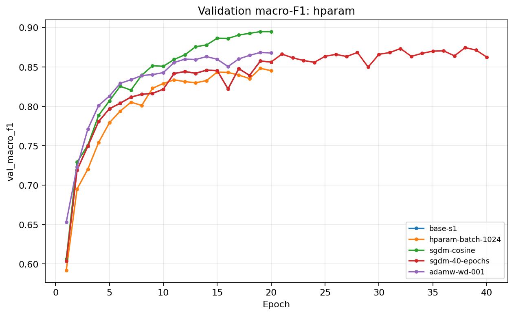
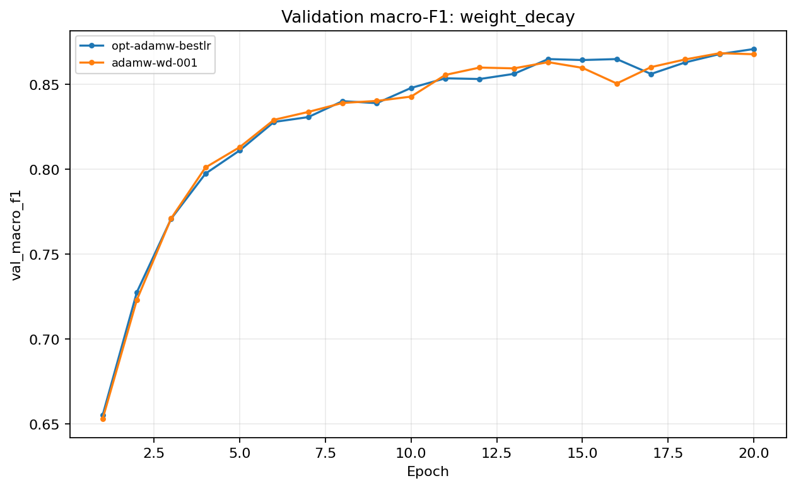
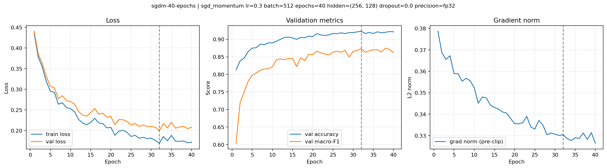
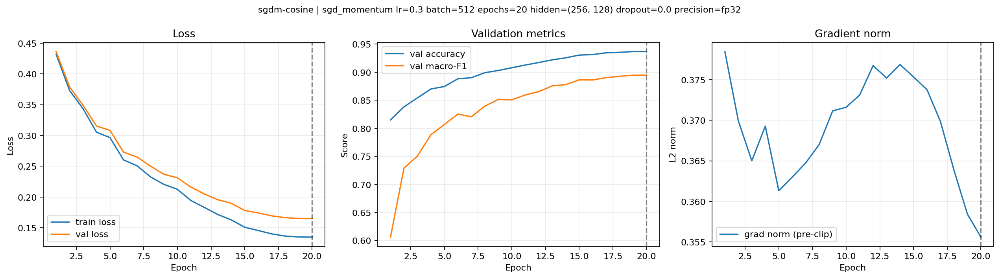

### 3.4 Dropout

Dự đoán trước `dropout-03`: dropout có thể không cải thiện mô hình nếu baseline chưa quá khớp. Với dropout 0,3, macro-F1 giảm xuống 0,7824. Khoảng cách train-val loss cuối giảm từ khoảng 0,026 ở baseline xuống 0,0069, nhưng train loss cũng tăng; trong thí nghiệm này dropout làm mô hình học chưa đủ thay vì cải thiện khả năng tổng quát hóa. Chênh lệch macro-F1 so với baseline là −0,0783.

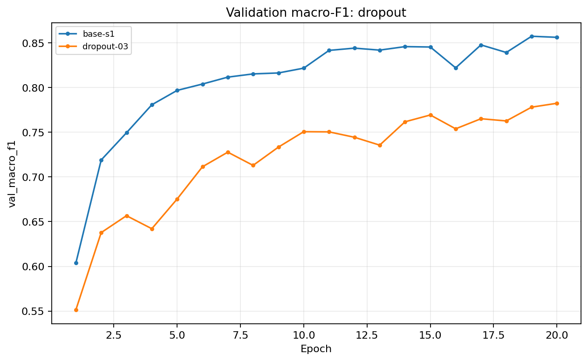

### 3.5 Gradient clipping

Ngưỡng clipping được đặt bằng một nửa median `grad_norm` của baseline: c = 0,1751. Với lr cao 3, không clipping (`clip-highlr-none`) đạt macro-F1 0,0936 và accuracy 0,4876, gần mức đoán lớp đa số. Khi bật clipping (`clip-highlr-c`), 84,0% bước gradient bị clip; macro-F1 tăng lên 0,5073 nhưng vẫn thấp hơn baseline 0,3534. Clipping giảm tác động của gradient lớn trong cấu hình này nhưng không bù được learning rate quá cao.

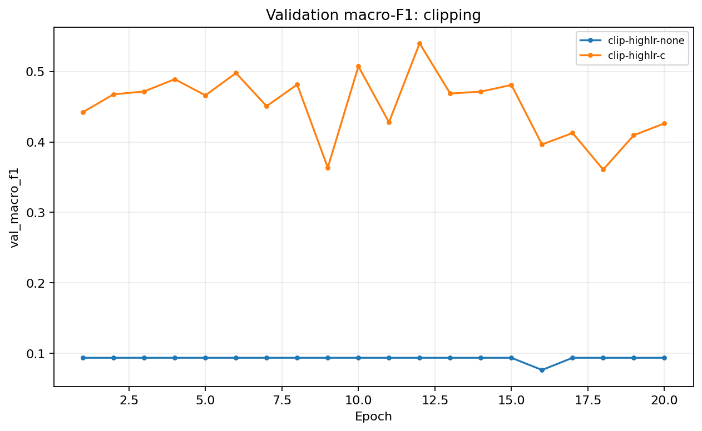

### 3.6 Mixed precision

Trên Tesla T4, FP16 đạt macro-F1 0,8502 và BF16 đạt 0,8506, thấp hơn baseline trung bình lần lượt 0,0105 và 0,0101. Thời gian mỗi epoch tăng lên 1,67 giây với FP16 và 1,52 giây với BF16, so với khoảng 1,2 giây ở FP32; bộ nhớ đỉnh ghi nhận xấp xỉ 162,4 MB ở cả ba cấu hình. Trong phép đo này mixed precision không tăng tốc hoặc giảm bộ nhớ.

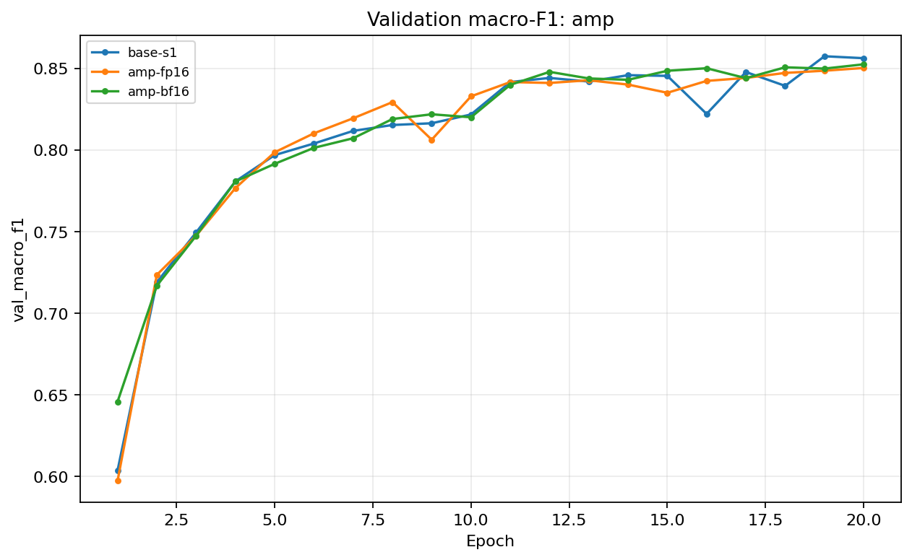

### 3.7 Khởi tạo tham số

He initialization tạo độ lệch chuẩn kích hoạt lần lượt khoảng 0,397; 0,371; 0,588 và loss bước 0 là 2,2691. Zero initialization cho độ lệch chuẩn bằng 0 ở cả ba tầng và loss bước 0 bằng ln(7) = 1,9459 do logits bằng nhau. Với ReLU tại 0, gradient không truyền qua các tầng ẩn; sau huấn luyện macro-F1 vẫn chỉ 0,0936 và accuracy 0,4876.

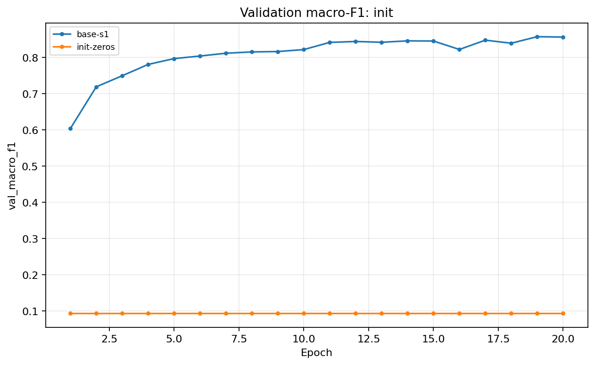

## 4. Đánh giá cuối trên tập eval

Cấu hình cuối được chọn theo validation macro-F1, không dùng eval để chọn cấu hình. `sgdm-cosine` dùng SGD momentum 0,9, lr ban đầu 0,3, cosine scheduler, batch 512, 20 epoch, seed 1 và He initialization.

| Cấu hình | Seed | Val macro-F1 | Eval macro-F1 | Eval accuracy |
|---|---:|---:|---:|---:|
| Baseline (`base-s1`) | 1 | 0,8573 | 0,8565 | 0,9089 |
| Cuối cùng (`sgdm-cosine`) | 1 | 0,8947 | 0,8951 | 0,9348 |

Eval macro-F1 tăng 0,0386 so với baseline. Trên validation, cấu hình cuối cao hơn baseline trung bình 0,0340, lớn hơn 2σ = 0,00595. Eval chỉ được chạy một lần cho baseline và cấu hình cuối, nên độ nhiễu trên eval chưa được đo.

### 4.1 Phân tích lỗi theo lớp

| Lớp | Support | Precision | Recall | F1 |
|---:|---:|---:|---:|---:|
| 0 | 42.368 | 0,9393 | 0,9271 | 0,9332 |
| 1 | 56.661 | 0,9398 | 0,9517 | 0,9457 |
| 2 | 7.151 | 0,9180 | 0,9270 | 0,9225 |
| 3 | 549 | 0,8399 | 0,8124 | 0,8259 |
| 4 | 1.899 | 0,8672 | 0,8115 | 0,8384 |
| 5 | 3.473 | 0,8617 | 0,8431 | 0,8523 |
| 6 | 4.102 | 0,9498 | 0,9456 | 0,9477 |

Lớp 3 có F1 thấp nhất (0,8259) và ít mẫu nhất (549); 77 mẫu lớp 3 bị dự đoán thành lớp 2. Lớp 4 có F1 thấp tiếp theo (0,8384), thường bị dự đoán thành lớp 1 (293 mẫu). Ma trận nhầm lẫn cho thấy những nhầm lẫn này tập trung ở các lớp ít mẫu; dữ liệu hiện tại chưa đủ để xác định đặc trưng nào gây ra sự chồng lấn.

## 5. Trả lời các câu hỏi dẫn dắt

1. Sau khi sàng lọc learning rate, Adam đạt 0,8677, SGD momentum baseline đạt trung bình 0,8607 ± 0,0030, còn SGD đạt 0,8163. Adam nhỉnh hơn baseline khoảng 0,0070, nhưng chỉ có một seed cho cấu hình Adam. Nếu so sánh sau 5 epoch mà chưa đủ thời gian học, thứ hạng và khoảng cách có thể khác; các kết quả sàng lọc chỉ dùng để chọn lr.
2. Dropout 0,3 giảm khoảng cách train-val loss nhưng giảm macro-F1 mạnh. Với baseline này, dấu hiệu quan sát được phù hợp với underfitting hơn là overfitting; dropout hữu ích hơn khi có bằng chứng mô hình đang quá khớp.
3. Clipping giới hạn norm gradient khi vượt ngưỡng. Ở lr 3, clipping kích hoạt ở 84,0% bước và cải thiện macro-F1 từ 0,0936 lên 0,5073; kết quả vẫn kém baseline, nên cần chọn lr hợp lý thay vì dựa vào clipping để cứu một lr quá cao.
4. Mixed precision không nhanh hơn trong phép đo này: thời gian mỗi epoch tăng và bộ nhớ đỉnh gần như không đổi. Với MLP này, chi phí chuyển đổi và kích thước mô hình có thể làm lợi ích phần cứng không rõ rệt.
5. Zero initialization khiến neuron ẩn giống nhau và ReLU tại 0 chặn gradient qua các tầng ẩn. He initialization giữ độ lớn kích hoạt phù hợp với mạng ReLU; Xavier phù hợp hơn khi muốn duy trì phương sai qua các lớp với giả định kích hoạt khác.
6. Khi loss không giảm, ba kiểm tra đầu tiên là: (i) xác nhận dữ liệu, nhãn và loss đúng bằng một forward pass; (ii) kiểm tra gradient có tồn tại, hữu hạn và khác 0 như kiểm tra gradient trong notebook; (iii) thử overfit một batch nhỏ để tách lỗi pipeline/gradient khỏi vấn đề tổng quát hóa. Sau đó kiểm tra learning rate và đường cong grad norm.

## 6. Hạn chế và điều bất ngờ

Các biến thể ngoài baseline chủ yếu chạy một seed; độ nhiễu đo được chỉ dựa trên ba seed baseline. Do đó các chênh lệch gần 2σ, như Adam và AdamW weight decay 0,01, cần được xem là gợi ý thay vì kết luận chắc chắn. Eval chỉ có một lần đo cho baseline và cấu hình cuối. Thời gian và bộ nhớ phản ánh một lần chạy trên Tesla T4, không đại diện cho mọi phần cứng.

Kết quả gây chú ý là cosine scheduler cải thiện macro-F1 validation rõ rệt trong cùng 20 epoch, còn tăng lên 40 epoch cho mức cải thiện nhỏ hơn. MSE, dropout 0,3 và zero initialization đều kém baseline; clipping giúp trong thử nghiệm lr cao nhưng không làm cấu hình đó trở nên tốt. Tổng thời gian trong log của 420 epoch xấp xỉ 8,9 phút, chưa gồm khởi tạo dữ liệu, đánh giá và vẽ biểu đồ.

## 7. Phụ lục

Gói nộp gồm `code/`, `experiments.xlsx`, `predictions_eval.csv`, `eval_result.json`, `figures/` và `results/`. Bảng có 29 thí nghiệm; mỗi thí nghiệm có một ảnh riêng, kèm ảnh so sánh theo nhóm. Các kết quả eval được lưu trong `eval_result.json` và bản dự đoán được kiểm tra có 116.203 dòng với nhãn 0–6.
